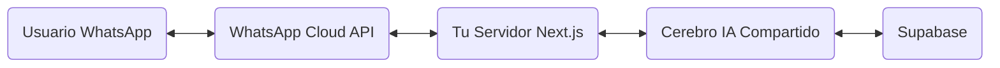

# Registro de Avances y Plan Futuro para SUMA

Fecha: 23 de Enero de 2026
Autor: Antigravity AI

## 1. Resumen de Logros de Hoy ✅

Hoy hemos realizado mejoras significativas en la plataforma, centradas en la experiencia del usuario y la inteligencia artificial.

### A. Corrección de Notificaciones 🔔
- **Problema**: Las notificaciones mostraban fechas incorrectas (usaban la hora actual en lugar del evento).
- **Solución**: Se corrigieron `notifications.tsx` (pacientes), `doctor-notifications.tsx`, y `clinic-notifications.tsx`.
- **Resultado**: Ahora las notificaciones de citas, pagos y mensajes muestran la fecha y hora real del evento.

### B. Asistente de IA "SUMA" Mejorado 🧠
Se ha transformado el asistente básico en una herramienta potente con:
1. **Inteligencia Real**: Integración con DeepSeek/OpenAI.
2. **Triaje Médico**: Capacidad de identificar especialidades según síntomas.
3. **Gestión de Citas**: 
   - Muestra citas pendientes del usuario.
   - Sugiere doctores con disponibilidad.
   - Compara precios (Económico vs Premium).
4. **Interacción por Voz**: Implementación de micrófono para dictar mensajes.
5. **Links Directos**: Recomendaciones con enlaces directos para agendar con un clic.
6. **Manejo de Errores**: Feedback claro si el micrófono no tiene permisos.

### C. Mejoras de UX en Agenda 📅
- Se agregó un botón de **"Iniciar Sesión"** explícito en la pantalla de selección de paciente ("¿Para quién es la cita?") cuando el usuario no está logueado, evitando confusión.

---

## 2. Plan para Integración con WhatsApp 📱

El siguiente gran paso es llevar este mismo asistente a WhatsApp para que los pacientes puedan agendar y consultar desde su app de mensajería favorita.

### Arquitectura Propuesta
Usaremos la **WhatsApp Cloud API** oficial de Meta.

### Paso a Paso para la Implementación

#### Fase 1: Preparación (Meta)
1. Crear cuenta en **Meta for Developers**.
2. Crear App tipo "Business" y configurar producto WhatsApp.
3. Obtener un número de teléfono de prueba (o usar uno real no registrado en WA).
4. Obtener `VERIFY_TOKEN` y `ACCESS_TOKEN`.

#### Fase 2: Backend (Tu Servidor)
1. **Refactorización del Cerebro IA**:
   - Actualmente la lógica está en `/api/ai/assistant/route.ts`.
   - **Acción**: Mover la lógica de generación de respuestas (prompts, fetching de doctores, lógica de precios) a una librería compartida, ej: `src/lib/ai/brain.ts`.
   - Esto permite que tanto la Web como WhatsApp usen la misma función `generateResponse(query, context)`.

2. **Crear Webhook**:
   - Crear ruta `/api/webhooks/whatsapp`.
   - Implementar método `GET` para verificación del token con Meta.
   - Implementar método `POST` para recibir mensajes entrantes.

#### Fase 3: Lógica del Webhook
- Recibir JSON de Meta.
- Extraer número de teléfono y mensaje de texto.
- Buscar usuario en Supabase por teléfono (opcional, para personalizar).
- Llamar al `brain.ts` con el mensaje.
- Enviar la respuesta a la API de WhatsApp (`POST https://graph.facebook.com/v17.0/PHONE_NUMBER_ID/messages`).

### Consideraciones Técnicas
- **Formato de Respuesta**: WhatsApp no soporta HTML ni Markdown complejo de la misma forma. Habrá que adaptar los links (ej: enviarlos como mensajes separados o texto plano).
- **Audio**: Se puede recibir audio de WhatsApp, transcribirlo con Whisper (OpenAI) y pasarlo a la IA.
- **Seguridad**: Validar la firma de los mensajes entrantes de info (`X-Hub-Signature`).

---

## 3. Próximas Mejoras Sugeridas 🚀

Además de WhatsApp, estas son funcionalidades potentes para el futuro:

1. **Agendamiento 100% Chat**:
   - Que la IA pueda crear la cita en la base de datos directamente ("Resérvame para el martes a las 10").
   - Requiere "Function Calling" avanzado.

2. **Recordatorios por WhatsApp**:
   - Usar la misma integración para enviar recordatorios automáticos 24h antes.

3. **Análisis de Imágenes**:
   - Permitir que el paciente suba una foto (ej: una erupción en la piel) y la IA sugiera dermatólogo (con disclaimer médico).

---

Este documento sirve como punto de partida para retomar el trabajo en la próxima sesión.
